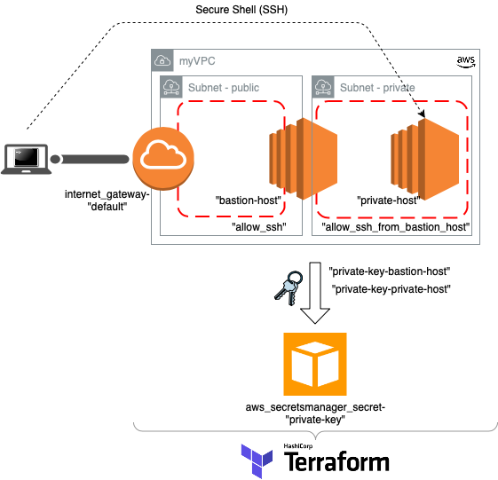
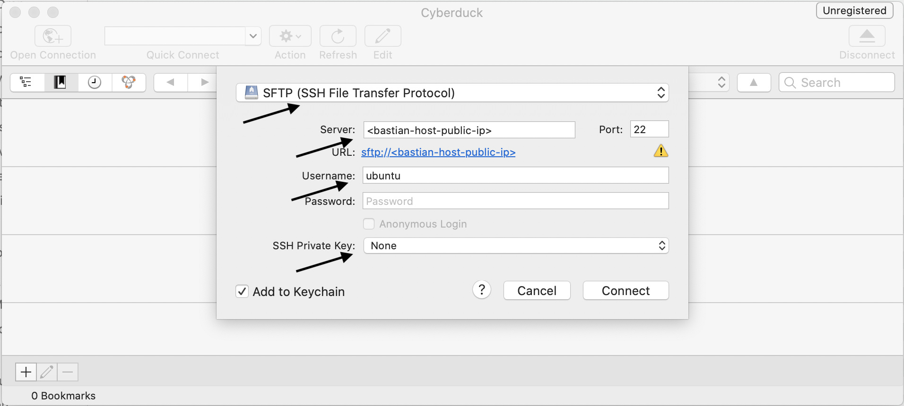
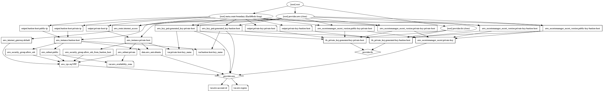

# Bastion host in AWS with Terraform

This article describes the process to build a Bastion host in the AWS cloud infrastructure using Terraform code. 
The goal is to access a private host which is not directly accessible from the public internet, but accessible via the Bastion host, so that the Bastion host can access the private host. Sometimes a Bastion host is also referred to as a "jump-host".

## Architecture 


## Prerequisite 
* Install [Terraform](https://www.terraform.io/downloads.html)
* (Optional) Install an integrated development environment (IDE) such as  ['Visual Studio Code(VSC)'](https://code.visualstudio.com)
* (Optional) Install the [Terraform VSC add-on](https://marketplace.visualstudio.com/items?itemName=itayadler.terraform-ssm)
* [Getting Your AWS Credentials](https://docs.aws.amazon.com/sdk-for-javascript/v2/developer-guide/getting-your-credentials.html)
* Setting up ["Authenticating to AWS with the Credentials File"] (https://blog.gruntwork.io/authenticating-to-aws-with-the-credentials-file-d16c0fbcbf9e) 
* Change the AWS account ID in Terraform-code/variables.tf (see below)

```
variable "aws-account-id"{
    default = "XXXXXXXXXXXX"
}
```
* (optional) Change AWS region and availability zone

```
variable "aws-region"{
    default = "ap-southeast-1"
}

variable "aws_availability_zone" {
  default = "ap-southeast-1a"
}

```

## Instructions

* Copy and unzip the Terraform code files in a folder of your choice.
* Run Terraform.

```
terraform init
terraform apply

```
### Result of terraform apply
```
Apply complete! Resources: 18 added, 0 changed, 0 destroyed.

Outputs:

bastion-host-private-ip = 10.0.1.XXX
bastion-host-public-ip = XXX.XXX.XXX.XXX
private-host-ip = 10.0.254.XXX
private-key-bastion-host = <sensitive>
private-key-private-host = <sensitive>
```
The IP addresses printed after Terraform has successfully built all the infrastructure is needed for the next steps.

## 1. Option to connect to Bastion host

```
#Get the two private keys and store it in a file
terraform output private-key-bastion-host > private-key-bastion-host.pem
terraform output private-key-private-host > private-key-private-host.pem

#Change permission on the private key file
chmod 400 private-key-bastion-host.pem

```
Copy private key (private-key-private-host.pem) of private host to Bastion host. 
Copy key via [Cyberduck](https://cyberduck.io) and [SFTP](https://cyberduck.io/sftp/) (see below).



Connect via SSH to Bastion host.

```
ssh -i private-key-bastion-host.pem ubuntu@<bastion-host-public-ip>

chmod 400 private-key-private-host.pem
```

Connect via SSH from Bastion host to private host.

```
ssh -i private-key-private-host.pem ubuntu@<private-host-ip>

```


## 2. Option, more secure with local port forwarding

The disadvantage of the above solution is that the Bastion host requires the private key of the private host to be stored remotely. Anyone who possesses the private key within the VPC could therefore access the private host. With SSH port forwarding, it is possible to access the private host without storing the private key on the Bastion host. To enhance security, it is also possible to tighten the security group so that only one IP (the Bastion host) could access the private host on port 22 (SSH).

##### Accessing the private host via local port forwarding

```
#Get keys if not already done
terraform output private-key-bastion-host > private-key-bastion-host.pem
terraform output private-key-private-host > private-key-private-host.pem
chmod 400 private-key-bastion-host.pem
chmod 400 private-key-private-host.pem

#Add both private keys to your keychain
ssh-add -K private-key-bastion-host.pem 
ssh-add -K private-key-private-host.pem  

#Open a local port which forwards the traffic to the private host
ssh -L 7777:<bastion-host-private-ip>:22 ubuntu@<bastion-host-public-ip>

#Open a second terminal locally
#Connect to the local port which is connected to the private host
ssh -i private-key-private-host.pem ubuntu@localhost -p 7777

```

## Webgraphviz
The website [Webgraphviz](http://www.webgraphviz.com) visualises the Terraform code. As source for this it uses the Terraform graph information which can be printed via the command "terraform graph". This enables the user to better understand and troubleshoot a Terraform project. Here it is used to represent the project.



###### Terraform graph
```
digraph {
	compound = "true"
	newrank = "true"
	subgraph "root" {
		"[root] aws_instance.bastion-host" [label = "aws_instance.bastion-host", shape = "box"]
		"[root] aws_instance.private-host" [label = "aws_instance.private-host", shape = "box"]
		"[root] aws_internet_gateway.default" [label = "aws_internet_gateway.default", shape = "box"]
		"[root] aws_key_pair.generated_key-bastion-host" [label = "aws_key_pair.generated_key-bastion-host", shape = "box"]
		"[root] aws_key_pair.generated_key-private-host" [label = "aws_key_pair.generated_key-private-host", shape = "box"]
		"[root] aws_route.internet_access" [label = "aws_route.internet_access", shape = "box"]
		"[root] aws_secretsmanager_secret.private-key" [label = "aws_secretsmanager_secret.private-key", shape = "box"]
		"[root] aws_secretsmanager_secret_version.private-key-bastion-host" [label = "aws_secretsmanager_secret_version.private-key-bastion-host", shape = "box"]
		"[root] aws_secretsmanager_secret_version.private-key-private-host" [label = "aws_secretsmanager_secret_version.private-key-private-host", shape = "box"]
		"[root] aws_secretsmanager_secret_version.public-key-bastion-host" [label = "aws_secretsmanager_secret_version.public-key-bastion-host", shape = "box"]
		"[root] aws_secretsmanager_secret_version.public-key-private-host" [label = "aws_secretsmanager_secret_version.public-key-private-host", shape = "box"]
		"[root] aws_security_group.allow_ssh" [label = "aws_security_group.allow_ssh", shape = "box"]
		"[root] aws_security_group.allow_ssh_from_bastion_host" [label = "aws_security_group.allow_ssh_from_bastion_host", shape = "box"]
		"[root] aws_subnet.private" [label = "aws_subnet.private", shape = "box"]
		"[root] aws_subnet.public" [label = "aws_subnet.public", shape = "box"]
		"[root] aws_vpc.myVPC" [label = "aws_vpc.myVPC", shape = "box"]
		"[root] data.aws_ami.ubuntu" [label = "data.aws_ami.ubuntu", shape = "box"]
		"[root] output.bastion-host-private-ip" [label = "output.bastion-host-private-ip", shape = "note"]
		"[root] output.bastion-host-public-ip" [label = "output.bastion-host-public-ip", shape = "note"]
		"[root] output.private-host-ip" [label = "output.private-host-ip", shape = "note"]
		"[root] output.private-key-bastion-host" [label = "output.private-key-bastion-host", shape = "note"]
		"[root] output.private-key-private-host" [label = "output.private-key-private-host", shape = "note"]
		"[root] provider.aws" [label = "provider.aws", shape = "diamond"]
		"[root] provider.tls" [label = "provider.tls", shape = "diamond"]
		"[root] tls_private_key.generated-key-bastion-host" [label = "tls_private_key.generated-key-bastion-host", shape = "box"]
		"[root] tls_private_key.generated-key-private-host" [label = "tls_private_key.generated-key-private-host", shape = "box"]
		"[root] var.aws-account-id" [label = "var.aws-account-id", shape = "note"]
		"[root] var.aws-region" [label = "var.aws-region", shape = "note"]
		"[root] var.aws_availability_zone" [label = "var.aws_availability_zone", shape = "note"]
		"[root] var.bastion-host-key_name" [label = "var.bastion-host-key_name", shape = "note"]
		"[root] var.private-host-key_name" [label = "var.private-host-key_name", shape = "note"]
		"[root] aws_instance.bastion-host" -> "[root] aws_security_group.allow_ssh"
		"[root] aws_instance.bastion-host" -> "[root] aws_subnet.public"
		"[root] aws_instance.bastion-host" -> "[root] data.aws_ami.ubuntu"
		"[root] aws_instance.bastion-host" -> "[root] var.bastion-host-key_name"
		"[root] aws_instance.private-host" -> "[root] aws_security_group.allow_ssh_from_bastion_host"
		"[root] aws_instance.private-host" -> "[root] aws_subnet.private"
		"[root] aws_instance.private-host" -> "[root] data.aws_ami.ubuntu"
		"[root] aws_instance.private-host" -> "[root] var.private-host-key_name"
		"[root] aws_internet_gateway.default" -> "[root] aws_vpc.myVPC"
		"[root] aws_key_pair.generated_key-bastion-host" -> "[root] provider.aws"
		"[root] aws_key_pair.generated_key-bastion-host" -> "[root] tls_private_key.generated-key-bastion-host"
		"[root] aws_key_pair.generated_key-bastion-host" -> "[root] var.bastion-host-key_name"
		"[root] aws_key_pair.generated_key-private-host" -> "[root] provider.aws"
		"[root] aws_key_pair.generated_key-private-host" -> "[root] tls_private_key.generated-key-private-host"
		"[root] aws_key_pair.generated_key-private-host" -> "[root] var.private-host-key_name"
		"[root] aws_route.internet_access" -> "[root] aws_internet_gateway.default"
		"[root] aws_secretsmanager_secret.private-key" -> "[root] provider.aws"
		"[root] aws_secretsmanager_secret_version.private-key-bastion-host" -> "[root] aws_secretsmanager_secret.private-key"
		"[root] aws_secretsmanager_secret_version.private-key-bastion-host" -> "[root] tls_private_key.generated-key-bastion-host"
		"[root] aws_secretsmanager_secret_version.private-key-private-host" -> "[root] aws_secretsmanager_secret.private-key"
		"[root] aws_secretsmanager_secret_version.private-key-private-host" -> "[root] tls_private_key.generated-key-private-host"
		"[root] aws_secretsmanager_secret_version.public-key-bastion-host" -> "[root] aws_secretsmanager_secret.private-key"
		"[root] aws_secretsmanager_secret_version.public-key-bastion-host" -> "[root] tls_private_key.generated-key-bastion-host"
		"[root] aws_secretsmanager_secret_version.public-key-private-host" -> "[root] aws_secretsmanager_secret.private-key"
		"[root] aws_secretsmanager_secret_version.public-key-private-host" -> "[root] tls_private_key.generated-key-private-host"
		"[root] aws_security_group.allow_ssh" -> "[root] aws_vpc.myVPC"
		"[root] aws_security_group.allow_ssh_from_bastion_host" -> "[root] aws_vpc.myVPC"
		"[root] aws_subnet.private" -> "[root] aws_vpc.myVPC"
		"[root] aws_subnet.private" -> "[root] var.aws_availability_zone"
		"[root] aws_subnet.public" -> "[root] aws_vpc.myVPC"
		"[root] aws_subnet.public" -> "[root] var.aws_availability_zone"
		"[root] aws_vpc.myVPC" -> "[root] provider.aws"
		"[root] data.aws_ami.ubuntu" -> "[root] provider.aws"
		"[root] meta.count-boundary (EachMode fixup)" -> "[root] aws_key_pair.generated_key-bastion-host"
		"[root] meta.count-boundary (EachMode fixup)" -> "[root] aws_key_pair.generated_key-private-host"
		"[root] meta.count-boundary (EachMode fixup)" -> "[root] aws_route.internet_access"
		"[root] meta.count-boundary (EachMode fixup)" -> "[root] aws_secretsmanager_secret_version.private-key-bastion-host"
		"[root] meta.count-boundary (EachMode fixup)" -> "[root] aws_secretsmanager_secret_version.private-key-private-host"
		"[root] meta.count-boundary (EachMode fixup)" -> "[root] aws_secretsmanager_secret_version.public-key-bastion-host"
		"[root] meta.count-boundary (EachMode fixup)" -> "[root] aws_secretsmanager_secret_version.public-key-private-host"
		"[root] meta.count-boundary (EachMode fixup)" -> "[root] output.bastion-host-private-ip"
		"[root] meta.count-boundary (EachMode fixup)" -> "[root] output.bastion-host-public-ip"
		"[root] meta.count-boundary (EachMode fixup)" -> "[root] output.private-host-ip"
		"[root] meta.count-boundary (EachMode fixup)" -> "[root] output.private-key-bastion-host"
		"[root] meta.count-boundary (EachMode fixup)" -> "[root] output.private-key-private-host"
		"[root] output.bastion-host-private-ip" -> "[root] aws_instance.bastion-host"
		"[root] output.bastion-host-public-ip" -> "[root] aws_instance.bastion-host"
		"[root] output.private-host-ip" -> "[root] aws_instance.private-host"
		"[root] output.private-key-bastion-host" -> "[root] tls_private_key.generated-key-bastion-host"
		"[root] output.private-key-private-host" -> "[root] tls_private_key.generated-key-private-host"
		"[root] provider.aws (close)" -> "[root] aws_instance.bastion-host"
		"[root] provider.aws (close)" -> "[root] aws_instance.private-host"
		"[root] provider.aws (close)" -> "[root] aws_key_pair.generated_key-bastion-host"
		"[root] provider.aws (close)" -> "[root] aws_key_pair.generated_key-private-host"
		"[root] provider.aws (close)" -> "[root] aws_route.internet_access"
		"[root] provider.aws (close)" -> "[root] aws_secretsmanager_secret_version.private-key-bastion-host"
		"[root] provider.aws (close)" -> "[root] aws_secretsmanager_secret_version.private-key-private-host"
		"[root] provider.aws (close)" -> "[root] aws_secretsmanager_secret_version.public-key-bastion-host"
		"[root] provider.aws (close)" -> "[root] aws_secretsmanager_secret_version.public-key-private-host"
		"[root] provider.aws" -> "[root] var.aws-account-id"
		"[root] provider.aws" -> "[root] var.aws-region"
		"[root] provider.tls (close)" -> "[root] tls_private_key.generated-key-bastion-host"
		"[root] provider.tls (close)" -> "[root] tls_private_key.generated-key-private-host"
		"[root] root" -> "[root] meta.count-boundary (EachMode fixup)"
		"[root] root" -> "[root] provider.aws (close)"
		"[root] root" -> "[root] provider.tls (close)"
		"[root] tls_private_key.generated-key-bastion-host" -> "[root] provider.tls"
		"[root] tls_private_key.generated-key-private-host" -> "[root] provider.tls"
	}
}

```

# Finally

Remove all your build infrastructure.

```
#Destroy 
terraform destroy

Destroy complete! Resources: 18 destroyed.

```

## Other useful commands
```
terraform output -json > outputs.json

#For quick testing, not recommended to use
terraform apply --auto-approve 
terraform destroy --auto-approve 

ssh-add -l #List all added ssh keys locally
/Users/XXXXXXX/.ssh/known_hosts #Shows all the added ssh keys
```


## References


* [AWS secret manager](https://registry.terraform.io/providers/hashicorp/aws/latest/docs/resources/secretsmanager_secret_version)
* [Terraform course](www.linkedin.com/learning/learning-terraform-2)
* [Connecting to an ec2 instance in a private subnet on AWS](https://towardsdatascience.com/connecting-to-an-ec2-instance-in-a-private-subnet-on-aws-38a3b86f58fb)


